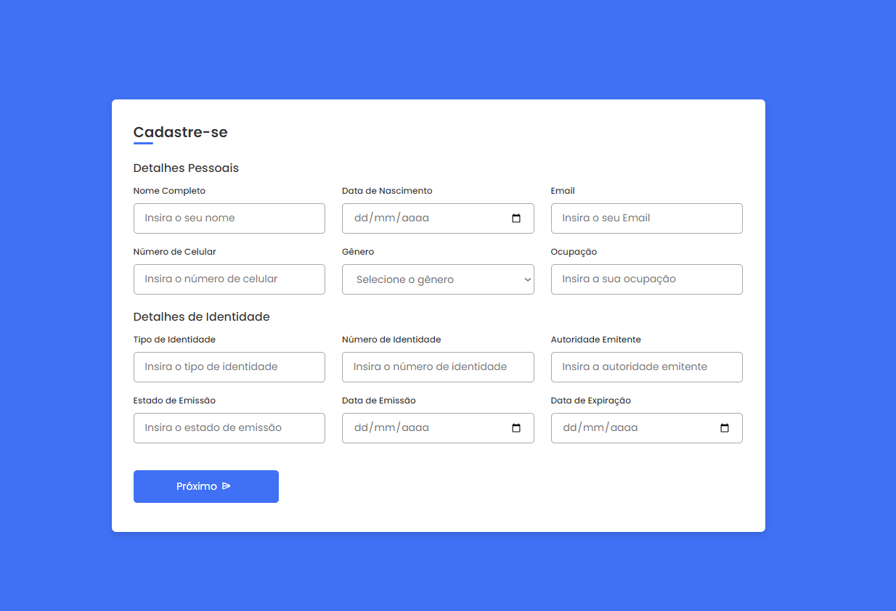

A pen created on Vinishireis
---
Forms Full Responsive

Layout and Structure:

Use a grid system to organize form elements flexibly and responsively.
Divide the form into logical sections using 
 or <section> tags for easier styling and responsiveness.
Input Fields:

Use appropriate input types for each field, such as text, email, password, number, etc.
Provide clear placeholders and labels to guide users on what to input in each field.
Implement input validation to ensure correct data before form submission.
Buttons and Actions:

Include submission and reset buttons with consistent and visible styles.
Consider adding subtle animations or visual feedback upon form submission to indicate successful action.
Responsiveness:

Utilize media queries in CSS to adjust layout and styles based on device screen size.
Test the form on various devices and orientations to ensure proper adaptation.
Design and Style:

Maintain a clean and professional design with cohesive colors, fonts, and spacing.
Ensure all form elements, including buttons, fields, and error messages, are easily visible and accessible.
Accessibility:

Make the form accessible to all users, including those with visual or motor impairments. This includes using labels for input fields, providing auditory feedback for error messages, and ensuring keyboard navigation.
Testing and Feedback:

Conduct extensive testing of the form on different devices and browsers to identify and fix layout or functionality issues.
Seek user feedback on form usability, especially on mobile devices, and make adjustments based on that feedback.
---
